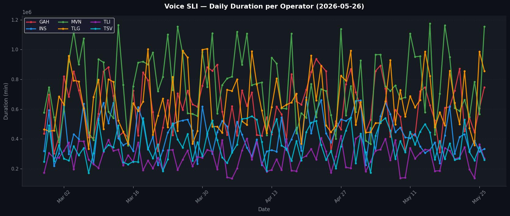
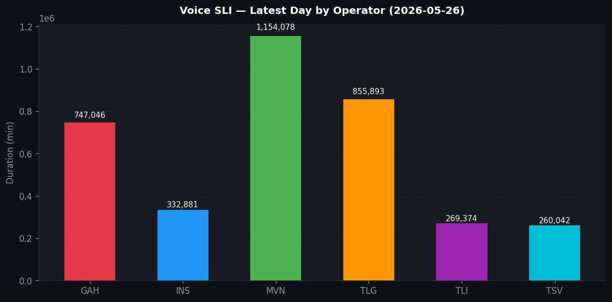

# 📊 Telecom Data Monitoring & Automated Reporting System


> Production-inspired portfolio project for telecom monitoring automation.
> This repository uses synthetically generated data only. No real operator data is included.

---

## 🎯 Business Problem

Interconnect operations teams need to monitor daily voice and SMS traffic across operators and segments.
In many environments, the process is still manual:

- Manual query execution every morning
- Manual chart building in spreadsheet tools
- Manual summary email creation to multiple stakeholders
- Repetitive workload (2-3 hours/day, 7 days/week)
- High risk of reporting inconsistency and human error

---

## ✅ Solution

This project automates the full reporting workflow using Python and Streamlit:

```text
Data Source (CSV / DB)
      |
      v
Python Pipeline
1) Load data
2) Aggregate by date and operator
3) Calculate DoD / WoW / MoM metrics
4) Detect anomalies
5) Generate charts
6) Send reports (email / WhatsApp)
      |
      v
Stakeholders receive daily report automatically
```

**Result:** zero manual routine work for daily baseline reporting.

---

## 🏗️ Architecture

```text
Monitoring Domains
- Voice SLI
- SMS A2P
- WhatsApp notification automation

Core Pipeline
data_loader.py -> processor.py -> chart_generator.py -> sender modules

Delivery Channels
- Email (SMTP)
- WhatsApp Web (Selenium)
- Streamlit dashboard (interactive)
```

---

## 📦 Key Features

### 1. Voice SLI Monitoring
- Tracks daily voice duration by operator (`GAH`, `INS`, `MVN`, `TLG`, `TLI`, `TSV`)
- Generates trend and summary visuals
- Calculates DoD and WoW changes

### 2. SMS A2P Monitoring
- Tracks daily SMS count by operator and OA
- Provides DoD and WoW trend analysis
- Includes Top OA breakdown and MO/MT composition view

### 3. Anomaly Detection
- Operator-level anomaly detection for Voice and SMS
- OA-level anomaly breakdown for SMS (latest-day DoD > threshold)

### 4. Automated Reporting
- Email sender with HTML body and chart embedding
- WhatsApp sender for group-based operational broadcasting

### 5. Interactive Dashboard
- Full dark-mode Streamlit UI
- Tabs for Voice and SMS
- KPI cards, trend charts, anomaly logs, and OA analysis
- Filter by date range and operators

### 6. Scheduler-Based Execution
- Daily pipeline run with APScheduler
- Timezone: `Asia/Jakarta`

---

## 🗂️ Project Structure

```text
telecom-monitoring-automation/
├── .streamlit/
│   └── config.toml                 # Streamlit theme configuration
├── app.py                          # Streamlit dashboard
├── main.py                         # End-to-end pipeline entry point
├── scheduler.py                    # Scheduled daily execution
├── scripts/
│   └── generate_dummy_data.py      # Synthetic dataset generator
├── src/
│   ├── data_loader.py              # CSV/data loading layer
│   ├── processor.py                # Aggregation, DoD/WoW/MoM, anomaly logic
│   ├── chart_generator.py          # Matplotlib charting utilities
│   ├── email_sender.py             # SMTP report sender
│   └── whatsapp_sender.py          # Selenium WhatsApp sender
├── data/
│   ├── sample_voice_sli.csv
│   ├── sample_sms_a2p.csv
│   └── ref_operator.csv
├── output/                         # Generated chart artifacts
├── wa_session/                     # WhatsApp Web session cache
├── .env.example                    # Environment template
├── requirements.txt
└── README.md
```

---

## 🚀 Quick Start

### 1. Install Dependencies

```bash
pip install -r requirements.txt
```

### 2. Generate Dummy Data

```bash
python scripts/generate_dummy_data.py
```

### 3. Run Streamlit Dashboard

```bash
streamlit run app.py
```

Open: `http://localhost:8501`

### Live Demo (Streamlit Cloud)

Deployed app: https://telecom-monitoring-automation.streamlit.app/

### Execution Proof

Below are generated artifacts from the automated reporting flow and dashboard output.

#### Email Report Proof


#### Generated Voice Charts





### 4. Run Pipeline Once (Recommended First Test)

```bash
python main.py --dry-run
```

Remove `--dry-run` to enable actual delivery functions.

### 5. Run Daily Scheduler

```bash
python scheduler.py
```

---

## ⚙️ Configuration

Copy `.env.example` to `.env`, then fill:

- `SMTP_HOST`
- `SMTP_PORT`
- `SMTP_USER`
- `SMTP_PASS`
- `EMAIL_TO`
- `WA_GROUP_NAME`

Notes:
- Gmail SMTP is supported via App Password.
- Keep `.env` private and never commit credentials.

---

## 📊 Data Schema (Sample)

### Voice SLI (`data/sample_voice_sli.csv`)

```text
call_date | operator | lokab | duration_min | charge
2026-05-01| GAH      | JKT   | 45823.5      | 1204500
```

### SMS A2P (`data/sample_sms_a2p.csv`)

```text
calldate  | oa_p2a   | momt | opr | sms_count | idr
2026-05-01| FACEBOOK | MO   | GAH | 581734    | 2450000
```

---

## 🧑‍💻 Tech Stack

| Layer | Tools |
|---|---|
| Data Processing | Python, pandas, NumPy |
| Visualization | Matplotlib |
| Dashboard | Streamlit |
| Scheduling | APScheduler |
| Notifications | smtplib, Selenium |
| Config Management | python-dotenv |

---

## 💡 Portfolio Context

This project demonstrates how enterprise-style operational reporting can be converted into a reliable, modular automation system.

What this showcases for clients:

- Automated daily reporting pipeline design
- Data transformation and anomaly logic in pandas
- Operational dashboard design with Streamlit
- Delivery channel integration (email + WhatsApp)
- Scheduler-based production workflow pattern

---

## 📢 Important Notes

- All datasets are dummy/synthetic for portfolio safety.
- WhatsApp automation depends on Chrome + compatible ChromeDriver.
- Email delivery depends on valid SMTP credentials.

---

## 👤 Author

**Gian Gianna**

- GitHub: [@giangianna14](https://github.com/giangianna14)
- Fiverr: `giangianna14`
- Company: PT Swamedia Informatika

Available for freelance work in data automation, reporting pipelines, and backend integration.

---

## 📄 License

MIT License (c) 2026 Gian Gianna
